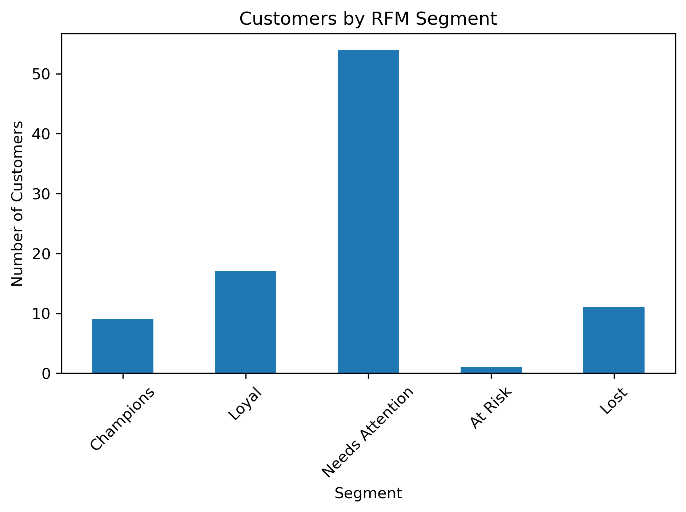
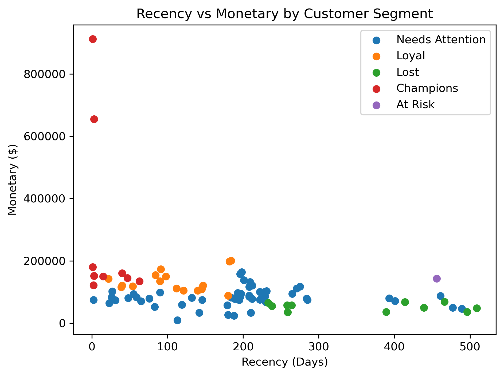
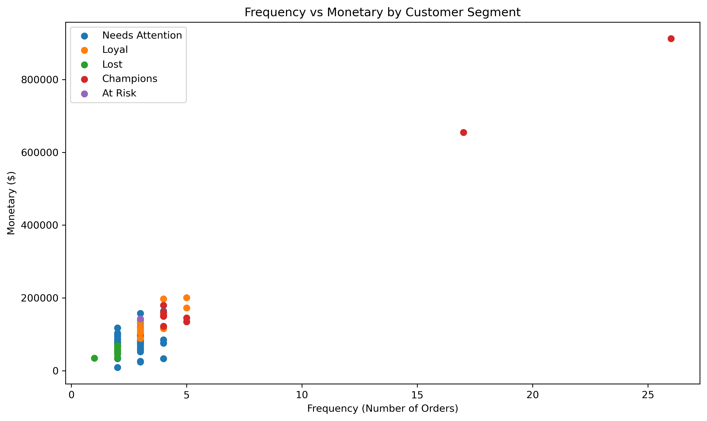
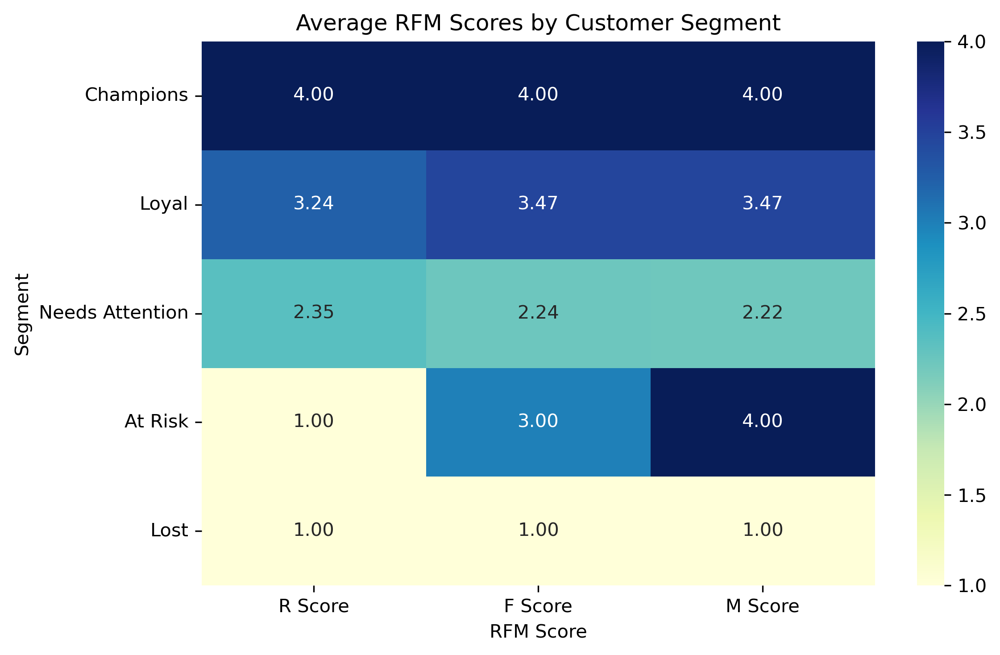
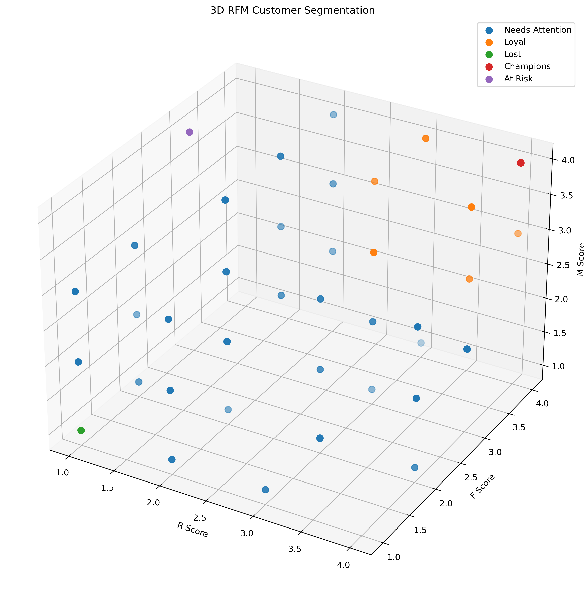

# RFM Customer Segmentation

A complete **RFM (Recency, Frequency, Monetary) Customer Segmentation** project using transactional sales data to analyze customer behavior, create customer segments, and develop targeted marketing strategies.

## Project Overview

RFM analysis evaluates customers based on three key purchasing behaviors:

- **Recency** — how recently a customer made a purchase
- **Frequency** — how often a customer placed an order
- **Monetary** — how much a customer spent

The goal of this project is to transform raw transaction data into meaningful customer segments and actionable marketing insights.

## Objectives

- Build a complete RFM analysis pipeline from raw transaction data
- Calculate Recency, Frequency, and Monetary values
- Apply quantile-based scoring using `pd.qcut()`
- Handle tied values during quantile scoring
- Apply Recency score inversion
- Create business-oriented customer segments
- Analyze customer segment characteristics
- Develop targeted marketing strategies
- Visualize customer segments
- Export the final RFM results

## Dataset

**Dataset:** `sales_data_sample (1).csv`

The dataset contains historical sales transactions, including:

- Order number
- Order date
- Customer name
- Sales
- Quantity ordered
- Price
- Product information
- Customer information

The analysis identified **92 unique customers**.

The reference date used for the RFM calculation was:

**2005-06-01**

## Technologies Used

- Python
- Pandas
- Matplotlib
- Seaborn
- Jupyter Notebook

## RFM Methodology

### Recency

Recency measures the number of days since a customer's most recent order.

```text
Recency = Reference Date - Last Order Date
```

A lower Recency value indicates more recent customer activity.

### Frequency

Frequency measures the number of unique orders placed by each customer.

```text
Frequency = Number of Unique ORDERNUMBER values
```

### Monetary

Monetary measures the total sales generated by each customer.

```text
Monetary = Sum of SALES
```

## RFM Scoring

Each RFM metric was divided into four quantile groups using `pd.qcut()`.

### Recency

Recency scoring is inverted because lower values are better:

| Score | Meaning |
|---|---|
| 4 | Most recent |
| 3 | Recent |
| 2 | Less recent |
| 1 | Least recent |

### Frequency

| Score | Meaning |
|---|---|
| 4 | Highest frequency |
| 3 | High frequency |
| 2 | Lower frequency |
| 1 | Lowest frequency |

### Monetary

| Score | Meaning |
|---|---|
| 4 | Highest monetary value |
| 3 | High monetary value |
| 2 | Lower monetary value |
| 1 | Lowest monetary value |

Because the dataset contains tied values, `rank(method="first")` was applied before `qcut()` to handle duplicate values and create the four scoring groups.

The three scores were combined into an RFM code.

For example, `444` represents the strongest RFM profile, while `111` represents the weakest RFM profile.

## Customer Segmentation

Five business-oriented customer segments were created.

| Segment | Customers | Description |
|---|---:|---|
| Champions | 9 | Highest-value and most recently active customers |
| Loyal | 17 | Strong and consistent purchasing behavior |
| Needs Attention | 54 | Customers requiring increased engagement |
| At Risk | 1 | Previously valuable but currently inactive |
| Lost | 11 | Inactive customers with low RFM scores |

## Segment Rules

### Champions

**Rule:** `R = 4, F = 4, M = 4`

Champions are the strongest customers across all three RFM dimensions.

**Marketing Strategy:**

- VIP rewards
- Exclusive offers
- Early access
- Premium loyalty benefits
- Personalized high-value offers

### Loyal

**Rule:** `R >= 3, F >= 3, M >= 3`

Champions are excluded from this group.

**Marketing Strategy:**

- Loyalty programs
- Personalized offers
- Cross-selling
- Repeat-purchase incentives

### Needs Attention

Customers who do not meet the criteria for the other defined segments.

**Marketing Strategy:**

- Personalized discounts
- Product recommendations
- Reminder campaigns
- Engagement offers
- Repeat-purchase incentives

### At Risk

**Rule:** `R = 1, F >= 3, M >= 3`

These customers have previously demonstrated relatively strong purchasing behavior but have become inactive.

**Marketing Strategy:**

- Win-back campaigns
- Personalized discounts
- Limited-time incentives
- Personalized email campaigns

### Lost

**Rule:** `R = 1, F = 1, M = 1`

These customers have low RFM scores and have not purchased recently.

**Marketing Strategy:**

- Reactivation campaigns
- Comeback offers
- Targeted promotions
- Personalized email campaigns

## RFM Results

| Metric | Minimum | Maximum | Average |
|---|---:|---:|---:|
| Recency | 1 | 509 | 182.83 |
| Frequency | 1 | 26 | 3.34 |
| Monetary | $9,129.35 | $912,294.11 | $109,050.31 |

### Segment Summary

| Segment | Customers | Avg Recency | Avg Frequency | Avg Monetary |
|---|---:|---:|---:|---:|
| Champions | 9 | 19.44 | 8.11 | $290,097.74 |
| Loyal | 17 | 110.29 | 3.59 | $132,894.92 |
| Needs Attention | 54 | 191.65 | 2.76 | $82,289.34 |
| At Risk | 1 | 456.00 | 3.00 | $142,874.25 |
| Lost | 11 | 360.45 | 1.91 | $52,366.99 |

## Visualizations

### Customer Segment Distribution



Shows the number of customers in each RFM segment.

### Recency vs Monetary



Shows the relationship between customer activity recency and total monetary value.

### Frequency vs Monetary



Shows the relationship between the number of orders and total customer spending.

### RFM Score Heatmap



Compares the average Recency, Frequency, and Monetary scores across customer segments.

### 3D RFM Segmentation



Visualizes customers across the three RFM scoring dimensions.

## Key Insights

- **Needs Attention** is the largest segment with **54 customers**, representing the main opportunity for customer engagement.
- **Champions** have the strongest combination of Recency, Frequency, and Monetary scores.
- **Loyal** customers represent a strong retention and cross-selling opportunity.
- **At Risk** customers require targeted win-back campaigns.
- **Lost** customers can be targeted with reactivation campaigns.

## Marketing Recommendations

| Segment | Main Objective | Recommended Action |
|---|---|---|
| Champions | Retention | VIP rewards and exclusive benefits |
| Loyal | Loyalty | Personalized offers and cross-selling |
| Needs Attention | Engagement | Discounts and personalized recommendations |
| At Risk | Win-back | Urgent personalized reactivation |
| Lost | Reactivation | Comeback offers and targeted campaigns |

## Project Outputs

- Customer-level RFM analysis
- RFM scores
- RFM segment codes
- Customer segmentation
- Segment summary
- Marketing recommendations
- RFM visualizations
- `rfm_customer_report.csv`
- `rfm_segment_summary.csv`
- `note.md`

## Project Structure

```text
RFM-Customer-Segmentation/
│
├── sales_data_sample (1).csv
├── rfm_customer_report.csv
├── rfm_segment_summary.csv
├── note.md
├── README.md
├── rfm_segmentation.ipynb
│
└── visuals/
    ├── rfm_segment_distribution.png
    ├── recency_vs_monetary.png
    ├── frequency_vs_monetary.png
    ├── rfm_score_heatmap.png
    └── rfm_3d_segmentation.png
```

## Data Note

The task brief contains reference statistics that differ from the results obtained from the provided CSV.

This project follows the required methodology:

- Frequency = unique `ORDERNUMBER`
- Monetary = total `SALES`
- Recency = days since the customer's last order
- Reference date = `2005-06-01`

Therefore, the reported statistics and segment counts are based on the actual provided dataset and the implemented methodology.

## Conclusion

This project demonstrates how transactional sales data can be transformed into actionable customer segments using RFM analysis.

The results highlight the importance of retaining high-value **Champions**, strengthening relationships with **Loyal** customers, engaging the large **Needs Attention** group, and implementing targeted reactivation strategies for **At Risk** and **Lost** customers.
